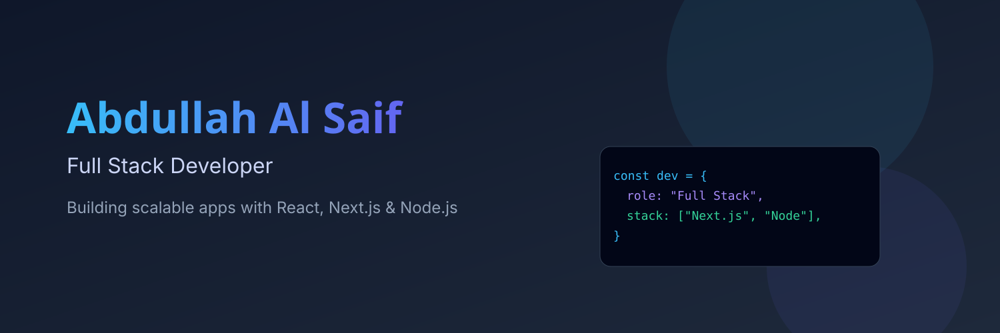

  

---

## 👨‍💻 About Me

- 💻 MERN & Next.js Developer | TypeScript • PostgreSQL • Prisma 
- 🏗️ Modular & Scalable Architecture Focused
- ⚡ Clean & Production Ready Code
- 🔐 Authentication & Secure API Specialist
- 🧠 Continuous Learner

---

## 🛠️ Tech Stack

### 🌐 Frontend

  

---

### ⚙️ Backend

  

---

### 🗄️ Database & ORM

  

---

### 🧰 Tools

  

---

## 📊 GitHub Stats

  

---

## 🔥 GitHub Streak

  

---

## 📫 Connect With Me

  <a href="https://github.com/rasifalsaif" target="_blank">
    
    <strong>rasifalsaif</strong>
  </a>
   
  <a href="https://linkedin.com/in/rasifalsaif" target="_blank">
    
    <strong>rasifalsaif</strong>
  </a>
   
  <a href="https://facebook.com/rasifalsaif" target="_blank">
    
    <strong>rasifalsaif</strong>
  </a>

<h3 align="center">💡 "Write Clean Code. Think Scalable. Build Production Ready Systems."</h3>
